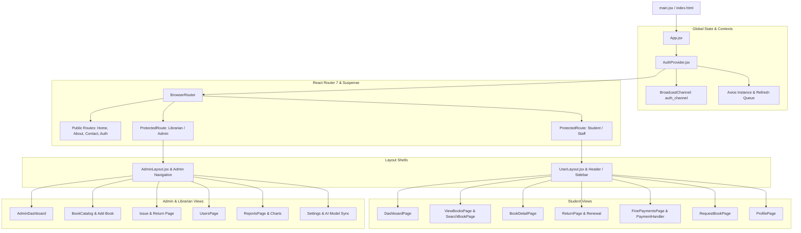

# 🌐 LibraryMS Web (Frontend Application)

[](https://react.dev/)
[](https://vitejs.dev/)
[](https://tailwindcss.com/)
[](https://reactrouter.com/)
[](https://axios-http.com/)
[](https://lucide.dev/)

Modern, ultra-responsive Single Page Application (SPA) frontend for the **Library Management System (LibraryMS)**. Engineered with **React 19**, **Vite 7**, **Tailwind CSS**, and **React Router 7**, providing seamless, role-optimized interfaces for Students, Staff, Librarians, and Administrators.

---

## 📑 Table of Contents

- [Core Features](#-core-features)
- [Application Architecture](#-application-architecture)
- [Project Directory Structure](#-project-directory-structure)
- [Role-Based Workspaces & Pages](#-role-based-workspaces--pages)
- [Authentication & Session Engine](#-authentication--session-engine)
- [Axios API Client & Interceptors](#-axios-api-client--interceptors)
- [Technology Stack](#-technology-stack)
- [Environment Variables](#-environment-variables)
- [Getting Started & Installation](#-getting-started--installation)
- [Available Scripts](#-available-scripts)
- [UI & Design System](#-ui--design-system)

---

## ✨ Core Features

### 🛡️ Secure Multi-Method Authentication & Session Sync
- **Dual Sign-In**: Native email/password authentication alongside seamless **Google OAuth 2.0** integration (`useGoogleIdentity`).
- **Resilient Session Management**: Automated session hydration on boot, quiet background token refreshes, and failure recovery.
- **Cross-Tab Synchronization**: Real-time cross-tab login and logout synchronization using the browser **BroadcastChannel API** (`auth_channel`).
- **Protected Routing**: Granular client-side route guards enforcing role permissions (`student`, `staff`, `librarian`, `admin`).

### 📚 Book Catalog & AI-Powered Discovery
- **Rich Catalog Exploration**: Multi-criteria book search, genre filters, and curated carousels (New Arrivals, Trending, Most Popular).
- **Comprehensive Book Detail Page**: Book overview, availability status, active copy counts, user ratings, community reviews, and comment threads.
- **AI Recommendation Engine Integration**: Real-time semantic vector recommendations showcasing personalized reading suggestions and content-similar books.
- **Social Engagement**: Interactive 1-5 star ratings, book bookmarks/likes, and threaded user comments.

### 👤 Student Self-Service Portal (`UserLayout`)
- **Student Dashboard**: Live summary cards displaying active borrowed books, upcoming due dates, outstanding dues, and reading history.
- **Circulation & Renewals**: View issued books with overdue indicators and one-click copy renewal.
- **Book Reservations**: Request out-of-stock books with automated queue tracking.
- **Fine Management & Payment Handler**: Modal-based fine payment system supporting cash reconciliation and simulated **UPI QR / ID payments**.
- **Personal Profile**: Activity logs, account statistics, and self-service password updates.

### ⚡ Administrative & Librarian Workspace (`AdminLayout`)
- **Admin Command Center**: Real-time KPI metrics (total inventory, active loans, overdue counts, registered members, revenue).
- **Circulation Desk**: Process student book issues, record returns, calculate late fees, and manage student reservation queues.
- **Catalog Management**: Add new books with cover art uploads, edit metadata, and manage copy inventory.
- **User Directory**: Searchable member roster with detailed borrowing histories and account statuses.
- **Visual Reports & Analytics**: Interactive chart visualizations and tabular exports covering circulation trends, overdue books, inventory breakdown, and revenue collection.
- **System Settings**: Configure library loan periods, daily fine rates, maximum borrowing limits, and trigger on-demand AI vector model syncs.

---

## 🏛 Application Architecture



---

## 📂 Project Directory Structure

```plaintext
LibraryWeb/
├── public/                                # Static public assets
├── src/
│   ├── api/                               # Centralized API service layer
│   │   ├── auth.js                        # Authentication & user profile endpoints
│   │   ├── axiosInstance.js               # Configured Axios client with refresh queue
│   │   └── recommendation.js              # AI vector recommendation endpoints
│   ├── assets/                            # Application images, logos, & banners
│   ├── components/                        # Reusable UI components & layouts
│   │   ├── auth/
│   │   │   ├── AuthShell.jsx              # Reusable authentication container
│   │   │   └── GoogleSignInButton.jsx     # Google OAuth sign-in button component
│   │   ├── AdminLayout.jsx                # Layout wrapper for admin & librarian portals
│   │   ├── AuthLoading.jsx                # Full-screen spinner for session hydration
│   │   ├── ChangePassword.jsx             # Password reset modal component
│   │   ├── DefaultPopup.jsx               # Confirmation modal dialogs
│   │   ├── Footer.jsx                     # Global site footer
│   │   ├── Header.jsx                     # Navigation bar with role-aware actions
│   │   ├── PaymentHandler.jsx             # Fine payment modal with UPI & Cash support
│   │   ├── protectedroutes.jsx            # Role-based route guard wrapper
│   │   ├── UIcomponent2.jsx               # Specialized widgets & data cards
│   │   ├── UIcomponents.jsx               # Buttons, badges, and card primitives
│   │   └── UserLayout.jsx                 # Layout wrapper for student portal
│   ├── context/
│   │   └── AuthProvider.jsx               # Auth state, session sync & role helpers
│   ├── hooks/                             # Custom React hooks
│   │   ├── Logout.js                      # Logout trigger hook
│   │   ├── useBookForm.js                 # Book creation & editing form hook
│   │   └── useGoogleIdentity.js           # Google Identity Services SDK loader
│   ├── pages/                             # Route-level page components
│   │   ├── AboutPage.jsx
│   │   ├── AdminDashboard.jsx             # Admin metrics & quick actions
│   │   ├── BookCatalog.jsx                # Admin book inventory manager
│   │   ├── BookDetailPage.jsx             # Book details, reviews & similar books
│   │   ├── ContactPage.jsx
│   │   ├── DashboardPage.jsx              # Student dashboard
│   │   ├── FeaturesPage.jsx
│   │   ├── FinePaymentsPage.jsx           # Student fine clearance portal
│   │   ├── HeroPage.jsx                   # Landing hero banner
│   │   ├── HomePage.jsx                   # Public home page
│   │   ├── HowitWorksPage.jsx
│   │   ├── Issue&ReturnPage.jsx           # Circulation desk (issue/return/requests)
│   │   ├── LoginPage.jsx                  # Email & Google login
│   │   ├── PricingPage.jsx
│   │   ├── ProfilePage.jsx                # Student profile & history
│   │   ├── ReportsPage.jsx                # Admin visual analytics & reports
│   │   ├── RequestBookPage.jsx            # Book request submission
│   │   ├── ResendVerificationPage.jsx     # Resend verification email
│   │   ├── ReturnPage.jsx                 # Student issued books & returns
│   │   ├── SearchBookPage.jsx             # Dedicated search interface
│   │   ├── Settings.jsx                   # Library system configuration & model sync
│   │   ├── SignupPage.jsx                 # Student registration
│   │   ├── TestimonialPage.jsx
│   │   ├── UsersPage.jsx                  # Admin user roster
│   │   ├── VerifyEmailPage.jsx            # Email verification confirmation
│   │   └── ViewBooksPage.jsx              # Public / Student catalog browser
│   ├── utils/                             # Helper utilities & data transformers
│   │   └── auth.js                        # User normalization & role checkers
│   ├── App.css
│   ├── App.jsx                            # Route dispatcher & code-split bundle
│   ├── index.css                          # Tailwind CSS imports & global styles
│   └── main.jsx                           # Application entry point
├── eslint.config.js
├── index.html
├── package.json
├── package-lock.json
├── postcss.config.js
└── vite.config.js                         # Vite build & bundle configuration
```

---

## 👥 Role-Based Workspaces & Pages

| Route | Page Component | Access Level | Description |
|---|---|---|---|
| `/` | `HomePage` | Public | Landing page featuring curated books & features |
| `/login` | `LoginPage` | Public | Dual Email/Password and Google OAuth login |
| `/signup` | `SignUpPage` | Public | Student account registration |
| `/verify-email` | `VerifyEmailPage` | Public | Email verification link handler |
| `/resend-verification` | `ResendVerificationPage` | Public | Request new verification email |
| `/dashboard` | `DashboardPage` | `student`, `staff` | Personal stats, active loans, and quick actions |
| `/books` | `ViewBooksPage` | `student`, `staff` | Complete catalog browser with genre filters |
| `/bookdetail` | `BookDetailPage` | `student`, `staff` | Book synopsis, reviews, ratings, and similar books |
| `/searchbook` | `SearchBookPage` | `student`, `staff` | Real-time search with instant filters |
| `/returnbook` | `ReturnPage` | `student`, `staff` | Active loans, due dates, and 1-click renewal |
| `/requestbook` | `RequestBookPage` | `student`, `staff` | Submit reservation for unavailable books |
| `/finepayments` | `FinePaymentsPage` | `student`, `staff` | View outstanding fines and execute payments |
| `/profile` | `ProfilePage` | `student`, `staff` | User information and activity history |
| `/admindashboard` | `AdminDashboard` | `admin`, `librarian` | System health overview and metric charts |
| `/catalog` | `BookCatalog` | `admin`, `librarian` | Book catalog inventory and copy management |
| `/requests` | `IssueReturnPage` | `admin`, `librarian` | Circulation desk (issue, return, request queue) |
| `/users` | `UsersPage` | `admin`, `librarian` | Student directory and borrowing profiles |
| `/reports` | `ReportsPage` | `admin`, `librarian` | Visual analytics and tabular report exports |
| `/settings` | `Settings` | `admin`, `librarian` | Library policy configuration and AI model sync |

---

## 🔐 Authentication & Session Engine

The authentication state is managed globally through `AuthProvider` (`src/context/AuthProvider.jsx`):

1. **Session Bootstrapping**: On initial load, the app queries `GET /v1/users/me` to determine if a valid cookie-backed session exists.
2. **Role Helpers**: Exposes intuitive boolean role flags: `isAdmin`, `isStaff`, `isStudent`.
3. **Cross-Tab Sync**: Uses a native `BroadcastChannel("auth_channel")` to broadcast `AUTH_LOGIN` and `AUTH_LOGOUT` events across all active browser tabs instantly.
4. **Code-Split Routing**: Uses `React.lazy()` and `<Suspense fallback={<AuthLoading />}>` to ensure optimal bundle loading performance.

---

## ⚡ Axios API Client & Interceptors

The API client (`src/api/axiosInstance.js`) includes enterprise-grade resilience features:

- **Automatic Refresh Queueing**: When a `401 Unauthorized` response is encountered, subsequent requests are placed into a queue while a single refresh request (`POST /v1/auth/refresh`) is dispatched. Once refreshed, all queued requests are replayed seamlessly without user disruption.
- **Recursion Prevention**: Dedicated `refreshClient` prevents infinite interceptor loops.
- **Exclusion List**: Public endpoints (login, signup, verification) bypass refresh logic to prevent unneeded network overhead.

---

## 🛠 Technology Stack

| Technology | Version | Purpose |
|---|---|---|
| **React** | ^19.1.1 | Modern declarative UI library with concurrent features |
| **Vite** | ^7.1.7 | Next-generation frontend tooling with lightning-fast HMR |
| **React Router** | ^7.9.3 | Dynamic client-side routing and protected navigation |
| **Tailwind CSS** | ^3.4.17 | Utility-first CSS framework for custom responsive design |
| **Lucide React** | ^0.544.0 | Clean, consistent icons across all user and admin portals |
| **Axios** | ^1.12.2 | Promise-based HTTP client with custom interceptor queue |
| **React Toastify** | ^11.0.5 | Toast notification alerts for success and error feedback |
| **Styled Components** | ^6.1.19 | Component-level CSS-in-JS styling for specific widgets |

---

## ⚙️ Environment Variables

Create a `.env` file in the root of `LibraryWeb/`:

```env
# ----------------------------------------------------
# Backend API Base URL (Including /v1 prefix)
# ----------------------------------------------------
VITE_API_BASE_URL=http://localhost:5000/v1

# ----------------------------------------------------
# Google OAuth 2.0 Client ID
# ----------------------------------------------------
VITE_GOOGLE_CLIENT_ID=your_google_client_id.apps.googleusercontent.com
```

---

## 🚀 Getting Started & Installation

### Prerequisites
- **Node.js** v18.0.0 or higher
- **npm** v9.0.0 or higher
- Running `LibraryServer` backend instance

### 1. Clone & Navigate
```bash
git clone https://github.com/your-org/LibraryMS.git
cd LibraryMS/LibraryWeb
```

### 2. Install Dependencies
```bash
npm install
```

### 3. Configure Environment
```bash
cp .env.example .env
# Update VITE_API_BASE_URL and VITE_GOOGLE_CLIENT_ID
```

### 4. Start Development Server
```bash
npm run dev
```
The application will be accessible at `http://localhost:5173`.

---

## 📜 Available Scripts

| Command | Description |
|---|---|
| `npm run dev` | Starts Vite local development server with Hot Module Replacement (HMR) |
| `npm run build` | Compiles and bundles production-ready static assets into `dist/` |
| `npm run preview` | Locally serves the production build for verification |
| `npm run lint` | Executes ESLint to check code quality and syntax standards |

---

## 🎨 UI & Design System

- **Responsive Grid & Flexbox**: Fully adaptive layouts supporting mobile devices, tablets, laptops, and ultra-wide displays.
- **Color Palette**: Sophisticated slate and indigo themes with accent colors for circulation states (green for available, red for overdue, amber for pending reservations).
- **Micro-Interactions**: Smooth hover effects, modal transitions, and interactive loading skeletons during data fetches.

---

## 📄 License

This project is licensed under the **ISC License**.
